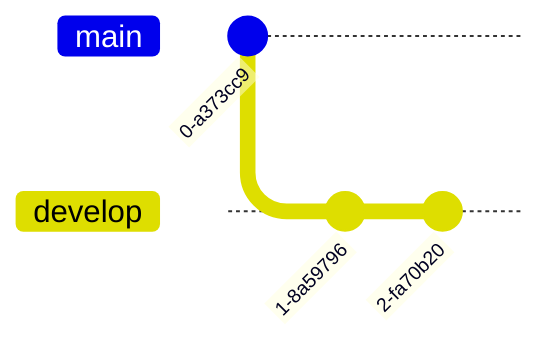
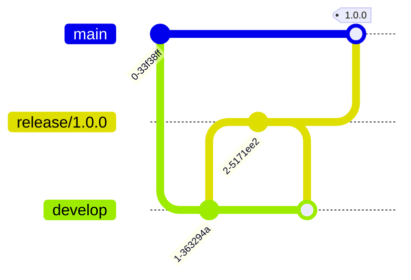
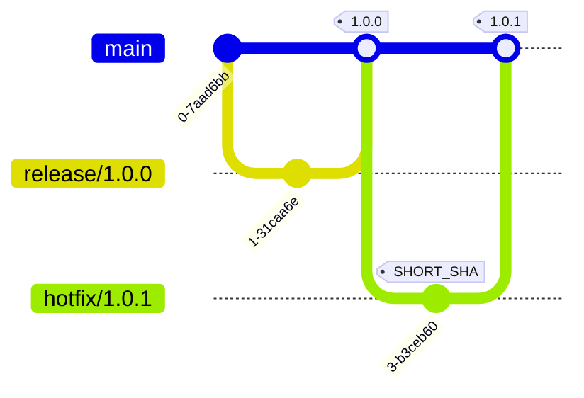
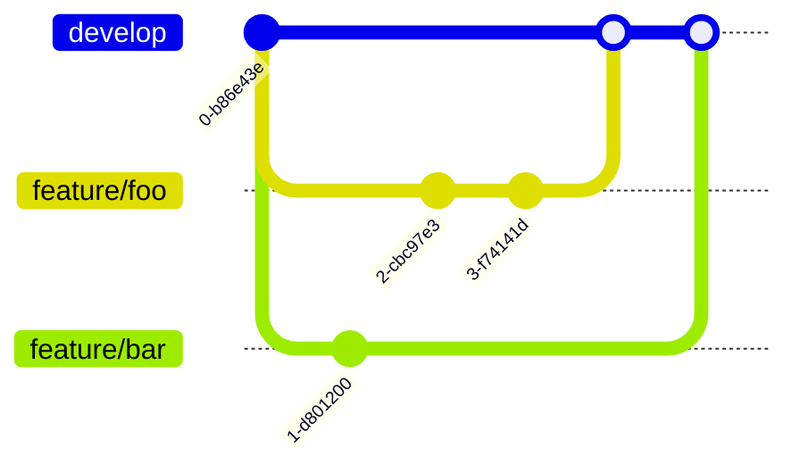
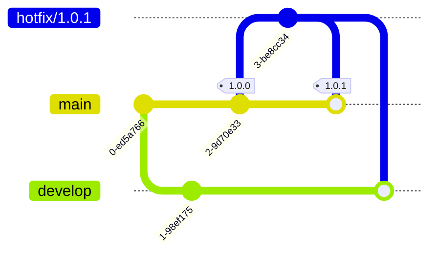

# Git Flow

[Git Flow](https://nvie.com/posts/a-successful-git-branching-model/) is a branching model for Git, originally created by Vincent Driessen. This article describes the modified coding flow for Git Flow.

:::note
In this article, `<SHORT_SHA>` refers to the first 8 digits of a Git commit identifier. `#.#` and `#.#.#` refer to semantic versioning where `#` can be any positive integer.
:::

## Overview

Here's a table that indicates the branch naming convention and what branches could be created from each branch:

| Branch           | Tags                                                        | Created From | Merge To             |
| ---------------- | ----------------------------------------------------------- | ------------ | -------------------- |
| `main`           | `<SHORT_SHA>` for debugging and `#.#.#` for making releases |              |                      |
| `develop`        | `<SHORT_SHA>` for debugging                                 | `main`       |                      |
| `feature/<name>` | `<SHORT_SHA>` for debugging                                 | `develop`    | `develop`            |
| `release/#.#.#`  | `<SHORT_SHA>` for debugging                                 | `develop`    | `main` and `develop` |
| `hotfix/#.#.#`   | `<SHORT_SHA>` for debugging                                 | `main`       | `main` and `develop` |

:::note
Use `^(main|develop|feature\/[a-zA-Z0-9._-]+|(release|hotfix)\/\d+\.\d+\.\d+)$` for branch name regex matching.
:::

## Main and Develop Branches

Main branch contains production-ready code, and every commit should be a release-ready state. Develop branch contains the latest changes for the next release:

## Release Branches

Release branches support the preparation of a new production release. They allow for last-minute defect fixes and preparing release metadata. They are created from the `develop` branch, followed by merging onto the `main` branch, and merged back into both `develop` and `main` branches upon completion:

## Tags

Tags are used to create releases. They are created on the `release` branches following semantic versioning for marking release points or on any branch using `SHORT_SHA` for marking debugging points:

## Feature Branches

Feature branches are used to develop new features or improvements. They are created from the `develop` branch and merged back upon completion:

## Hotfix Branches

Hotfix branches are used to address critical issues or security breaches. They are created from the `main` branch and merged back into both `main` and `develop` branches upon completion:

