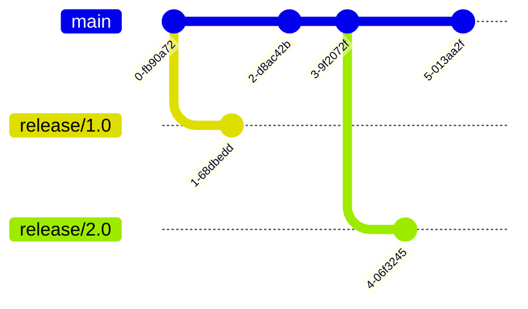
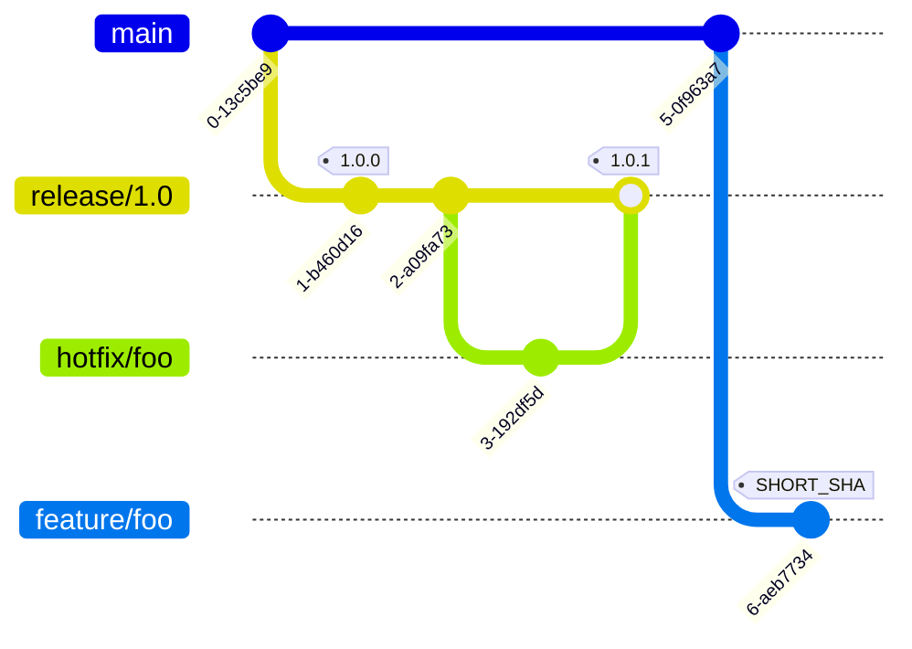
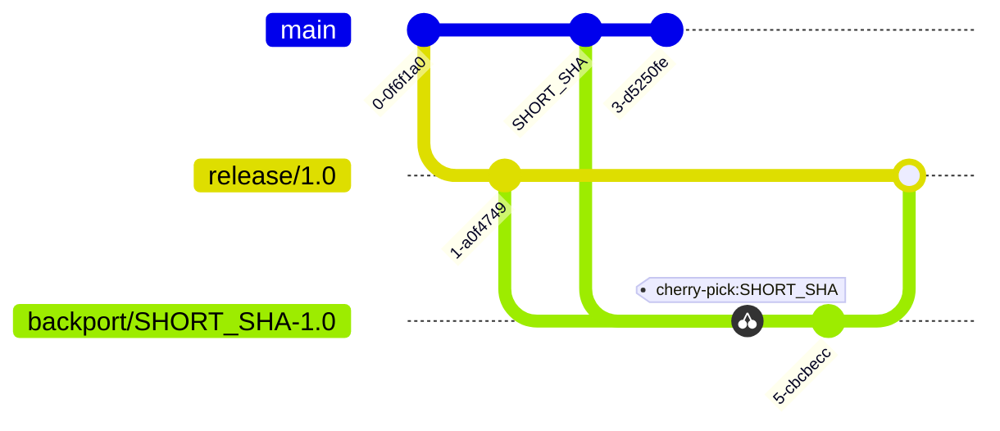
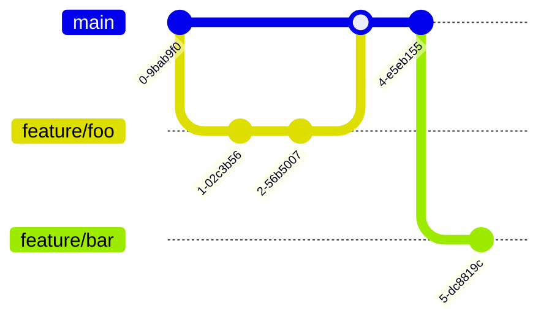
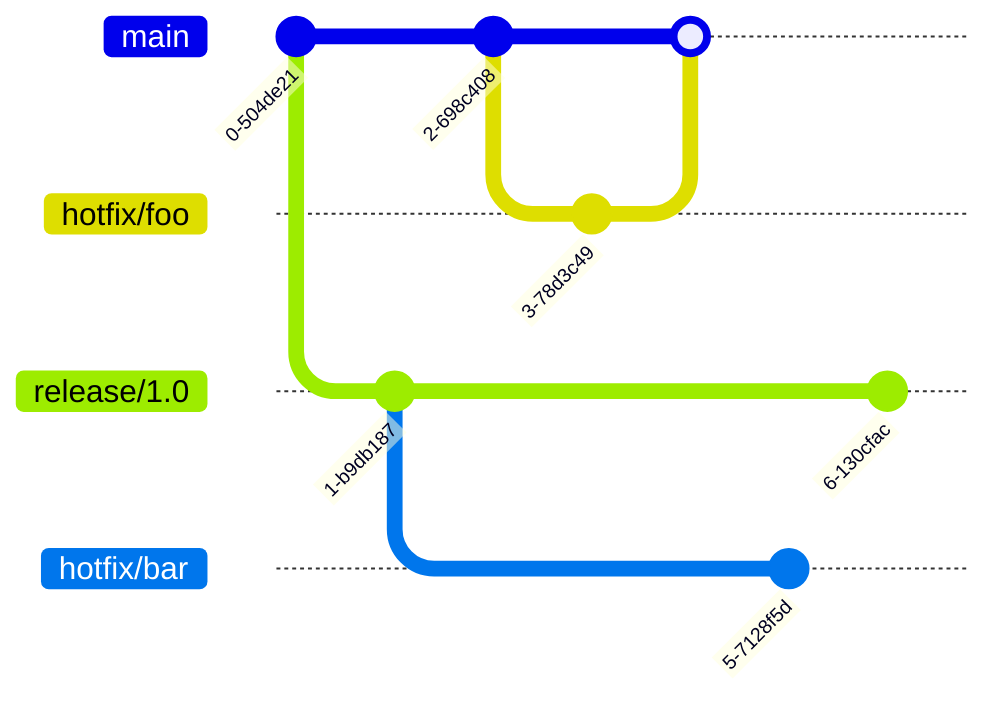

# Long-Term Support

Long-Term Support (LTS) is a practice of maintaining software versions for an extended period, ensuring stability and providing critical updates. This article describes the coding flow for managing LTS branches and tags. This article describes the setup using Docker, Git, and GitLab, and the coding flow for LTS.

:::note
In this article, `<SHORT_SHA>` refers to the first 8 digits of a Git commit identifier. `#.#` and `#.#.#` refer to semantic versioning where `#` can be any positive integer.
:::

## Coding Flow

The branches and tags are illustrated here for better understanding of the setup.

### Overview

Here's a table that indicates the branch naming convention and what branches could be created from each branch:

| Branch                     | Tags                                                        | Created From            | Merge To                |
| -------------------------- | ----------------------------------------------------------- | ----------------------- | ----------------------- |
| `main`                     | `<SHORT_SHA>` for debugging                                 |                         |                         |
| `feature/<name>`           | `<SHORT_SHA>` for debugging                                 | `main`                  | `main`                  |
| `release/#.#`              | `<SHORT_SHA>` for debugging and `#.#.#` for making releases | `main`                  |                         |
| `hotfix/<name>`            | `<SHORT_SHA>` for debugging                                 | `main` or `release/#.#` | `main` or `release/#.#` |
| `backport/<SHORT_SHA>-#.#` | `<SHORT_SHA>` for debugging                                 | `release/#.#`           | `release/#.#`           |

### Long-Term Support Branches

The LTS branches are created for major versions that require extended support from the `main` branch. They are used to maintain stability and provide critical updates over an extended period:

### Tags

Tags are used to create releases. They are created on the `release` branches following semantic versioning for marking release points or on any branch using `SHORT_SHA` for marking debugging points:

### Backport Branches

Backport branches are used to apply a fix or feature from a newer version to an older version to ensure that critical updates are available to previous `release` branches. They are created from the `release` branches and merged back to the source branch upon completion of cherry-picking commit `SHORT_SHA` from a newer version:

### Feature Branches

Feature branches are used to develop new features or improvements. They are created from the `main` branch and merged back upon completion:

### Hotfix Branches

Hotfix branches are used to address critical issues or security breaches. They are created from the `main` or `release` branches and merged back to the source branch upon completion:

