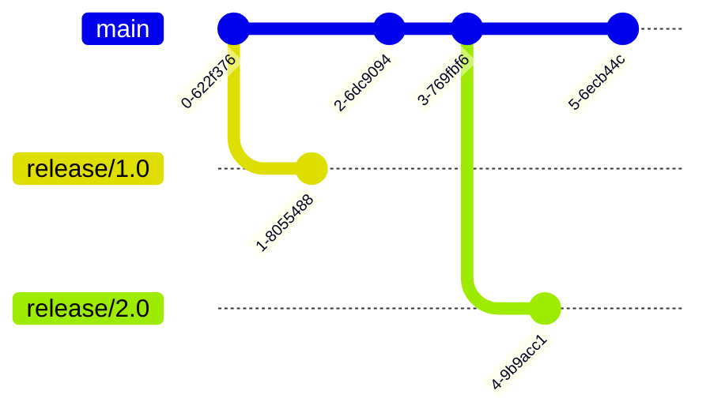
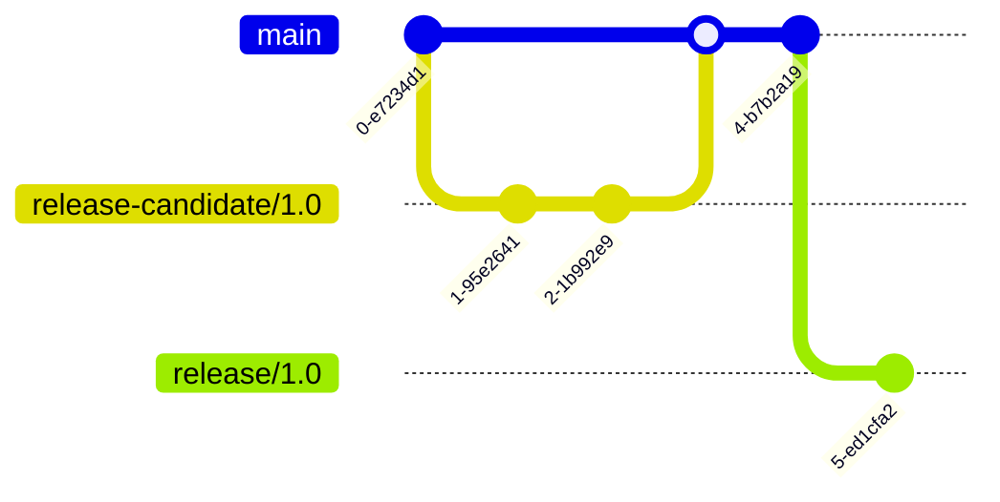
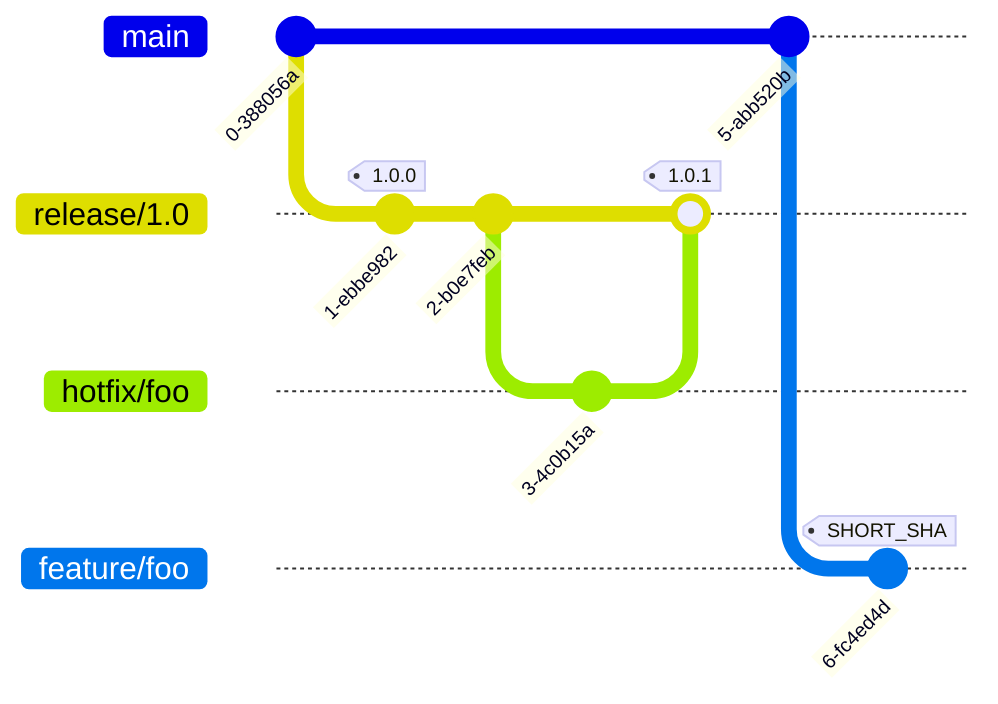
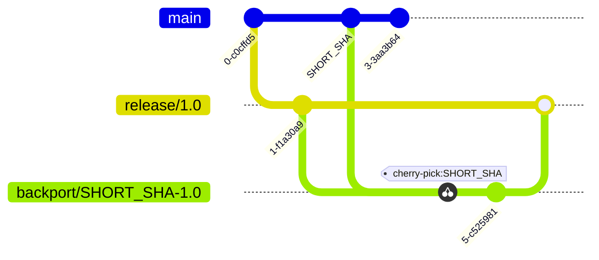
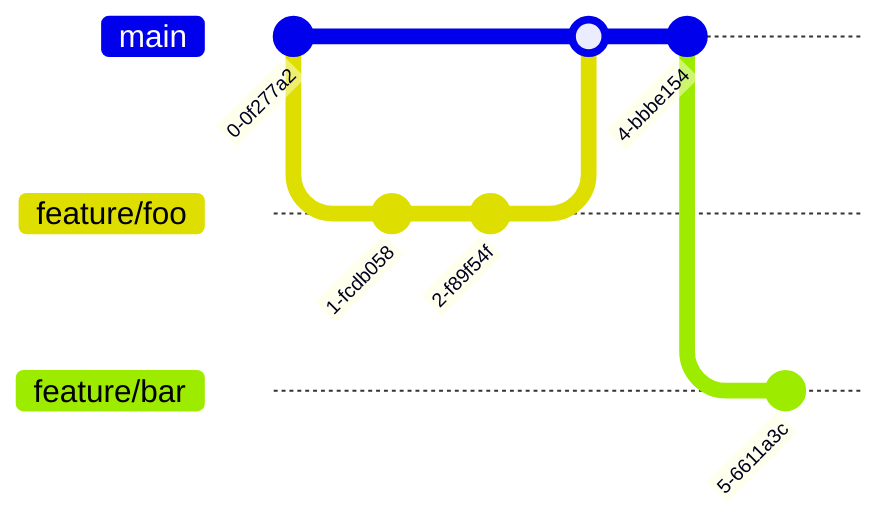
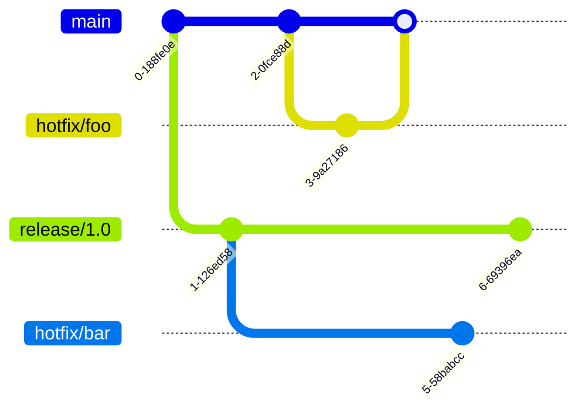

# Long-Term Support

Long-Term Support (LTS) is a practice of maintaining software versions for an extended period, ensuring stability and providing critical updates. This article describes the coding flow for managing LTS branches and tags. This article describes the coding flow for LTS.

:::note
In this article, `<SHORT_SHA>` refers to the first 8 digits of a Git commit identifier. `#.#` and `#.#.#` refer to semantic versioning where `#` can be any positive integer.
:::

## Overview

Here's a table that indicates the branch naming convention and what branches could be created from each branch:

| Branch                            | Tags                                                                            | Docker Image  | NuGet Package                                                                 | Created From            | Merge To                |
| --------------------------------- | ------------------------------------------------------------------------------- | ------------- | ----------------------------------------------------------------------------- | ----------------------- | ----------------------- |
| `main`                            | `main-<SHORT_SHA>` for debugging                                                | Same as Tags  | `0.0.0-main.<SHORT_SHA>` for debugging                                        |                         |
| `feature/<name>`                  | `feature-<name>-<SHORT_SHA>` for debugging                                      | Same as Tags  | `0.0.0-feature.<name>.<SHORT_SHA>` for debugging                              | `main`                  | `main`                  |
| `release-candidate/#.#`           | `release-candidate-#.#-<SHORT_SHA>` for debugging                               | Same as Tags. | `0.0.0-release.candidate.#.#.<SHORT_SHA>` for debugging                       | `main`                  | `main`                  |
| `release/#.#`                     | `release-#.#-<SHORT_SHA>` for debugging and `release-#.#.#` for making releases | Same as Tags  | `0.0.0-release.#.#.<SHORT_SHA>` for debugging and `#.#.#` for making releases | `main`                  |                         |
| `hotfix/<name>`                   | `hotfix-<name>-<SHORT_SHA>` for debugging                                       | Same as Tags  | `0.0.0-hotfix.<name>.<SHORT_SHA>` for debugging                               | `main` or `release/#.#` | `main` or `release/#.#` |
| `backport/<SHORT_SHA_SOURCE>-#.#` | `backport-<SHORT_SHA_SOURCE>-#.#-<SHORT_SHA_CURRENT>` for debugging             | Same as Tags  | `0.0.0-backport.<SHORT_SHA_CURRENT>.#.#` for debugging                        | `release/#.#`           | `release/#.#`           |

:::note
Use the following regex for branch name matching on _GitLab - Project - Settings - Repository - Push Rules_:

```
^(main|(feature|hotfix)\/[a-zA-Z0-9._-]+|release-candidate\/\d+\.\d+|release\/\d+\.\d+|backport\/[a-zA-Z0-9]{8}\-\d+\.\d+)$
```


:::

:::note
Use wildcard to create patterns to match each branch name to configure protected branches on _GitLab - Project - Settings - Repository - Protected Branches_:


:::

### Mapping

Use the scripts in this sections to map the tag to the targeted environment.

#### NuGet

Only semantical versioning values are allowed:

```shell
#!/bin/bash

# main-<SHORT_SHA> to 0.0.0-main.<SHORT_SHA>
if [[ "$CI_COMMIT_TAG" =~ ^main-([a-f0-9]+)$ ]]; then
    _VERSION="0.0.0-main.${BASH_REMATCH[1]}"
# feature-<name>-<SHORT_SHA> to 0.0.0-feature.<name>.<SHORT_SHA>
elif [[ "$CI_COMMIT_TAG" =~ ^feature-([z-a0-9-]+)-([a-f0-9]+)$ ]]; then
    _VERSION="0.0.0-feature.${BASH_REMATCH[1]}.${BASH_REMATCH[2]}"
# release-candidate-#.#-<SHORT_SHA> to 0.0.0-release.candidate.#.#.<SHORT_SHA>
elif [[ "$CI_COMMIT_TAG" =~ ^release-candidate-([0-9]+\.[0-9]+)-([a-f0-9]+)$ ]]; then
    _VERSION="0.0.0-release.candidate.${BASH_REMATCH[1]}.${BASH_REMATCH[2]}"
# release-#.#-<SHORT_SHA> to 0.0.0-release.#.#.<SHORT_SHA>
elif [[ "$CI_COMMIT_TAG" =~ ^release-([0-9]+\.[0-9]+)-([a-f0-9]+)$ ]]; then
    _VERSION="0.0.0-release.${BASH_REMATCH[1]}.${BASH_REMATCH[2]}"
# release-#.#.# to #.#.#
elif [[ "$CI_COMMIT_TAG" =~ ^release-([0-9]+\.[0-9]+\.[0-9]+)$ ]]; then
    _VERSION="${BASH_REMATCH[1]}"
# hotfix-<name>-<SHORT_SHA> to 0.0.0-hotfix.<name>.<SHORT_SHA>
elif [[ "$CI_COMMIT_TAG" =~ ^hotfix-([z-a0-9-]+)-([a-f0-9]+)$ ]]; then
    _VERSION="0.0.0-hotfix.${BASH_REMATCH[1]}.${BASH_REMATCH[2]}"
# backport-<SHORT_SHA_SOURCE>-#.#-<SHORT_SHA_CURRENT> to 0.0.0-backport.<SHORT_SHA_SOURCE>.#.#.<SHORT_SHA_CURRENT>
elif [[ "$CI_COMMIT_TAG" =~ ^backport-([a-f0-9]+)-([0-9]+\.[0-9]+)-([a-f0-9]+)$ ]]; then
    _VERSION="0.0.0-backport.${BASH_REMATCH[1]}.${BASH_REMATCH[2]}.${BASH_REMATCH[3]}"
else
    echo "Invalid CI_COMMIT_TAG format: $CI_COMMIT_TAG"
    exit 1
fi

echo "$_VERSION"
```

## Long-Term Support Branches

The LTS branches are created for major versions that require extended support from the `main` branch. They are used to maintain stability and provide critical updates over an extended period:



## Release Candidate Branches

Release Candidate branches are used for final testing. They are created from the `main` branch and merged back upon completion. LTS branches are created after it:



## Tags

Tags are used to create releases. They are created on the `release` branches following semantic versioning for marking release points or on any branch using `SHORT_SHA` for marking debugging points:



## Backport Branches

Backport branches are used to apply a fix or feature from a newer version to an older version to ensure that critical updates are available to previous `release` branches. They are created from the `release` branches and merged back to the source branch upon completion of cherry-picking commit `SHORT_SHA` from a newer version:



## Feature Branches

Feature branches are used to develop new features or improvements. They are created from the `main` branch and merged back upon completion:



## Hotfix Branches

Hotfix branches are used to address critical issues or security breaches. They are created from the `main` or `release` branches and merged back to the source branch upon completion:


