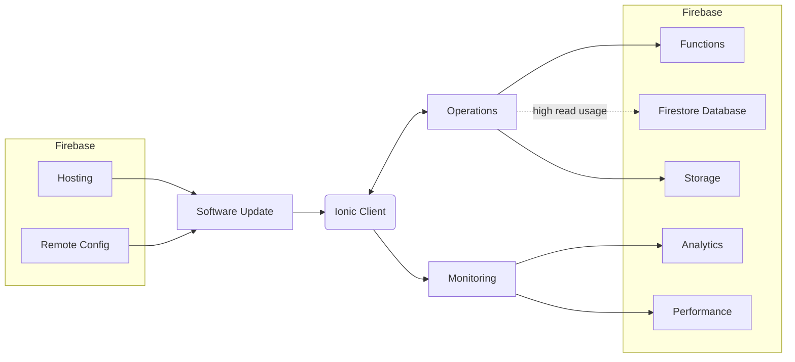

This is actually quite a milestone. I built an Ionic application using Firebase 4 years ago, and it has been running smoothly since then. However, recently the users are reporting the issue that some of them are seeing the `quota has been exceeded` error toast when they are trying to check-in on their phones.

<!-- description -->

### Background

Some screenshots for the check-in feature. The toast would pop up after submitting the record. The application doesn't have i18n support since it is solely used in-house by [Servicetech](https://servicetech.com.tw/), a company based in Taiwan:

| Auto-Fill Geo Information                                                | Photo and Business Purpose                                               | Select Purpose                                                           | Optional Information                                                     | Select Date                                                              |
| ------------------------------------------------------------------------ | ------------------------------------------------------------------------ | ------------------------------------------------------------------------ | ------------------------------------------------------------------------ | ------------------------------------------------------------------------ |
|  |  |  |  |  |

Before diving into the investigation, let's first understand the architecture of the application. It is a pretty standard serverless Firebase application structure. Some services are not shown in the diagram for simplicity and _high read usage_ is highlighted as it is the main concern. No non-Google services were used:



## Investigation

My first thought was that the credit card for the Firebase project might be expired, then the project is downgraded to the free plan, which has very limited quota. However, after checking the billing section of the Firebase console, I confirmed that the credit card is still valid and the project is still on the Blaze plan:


This screenshot doesn't really make a sense since I masked all the numbers, but the billing history showed that there was no abnormal charges in the past few months:


Next, I thought there might be some hard quota limits set on the Firestore database regardless the plan. So, I checked the usage section in the Firebase console, and found that the read usage is indeed very high, which is abnormal for a 30-user base, but there is no indication of any hard quota limits being hit:


This makes me wonder what is causing the high read usage. Because I remember that I implemented a lot in local caching and fresh data reusing strategies to minimize the read operations to the Firestore database. So I started questioning if the `quota has been exceeded` error has anything to do with Firebase.

## Resolution

Given that the Ionic application is a PWA, Progressive Web App, I suspected that the caching mechanism might be saving multiple documents on their local end since it revalidates the cached data once in a while, and the users might have multiple tabs opened at the same time. It is highly possible if a user opens multiple tabs and having them on different documents, then the read and cache operations would be multiplied.

I then did a quick test with the following code snippet in the Safari console:

```javascript
(function () {
  try {
    for (let i = 0; i < Infinity; i++) {
      localStorage.setItem(i, i);
    }
  } catch (error) {
    console.error(error);
    localStorage.clear();
  }
})();
```

A `QuotaExceededError: The quota has been exceeded.` error was thrown. This confirms my suspicion. I then asked some of the users to clear their browser cache and local storage, and the issue was resolved.

### Root Cause

I pushed a minor patch 2 years ago to improve the check-in feature, and somehow an expected error was not thrown but only a toast was shown to the users instead, which prevented the application from clearing the local storage. The check-in records, regardless of seeing the error or not, were still being written to the Firestore database.

### Follow-Up

This is purely a mishandled error on my side. I didn't log the errors properly, and I didn't have enough tests to cover this workflow. A good lesson learned anyways and a patch was pushed to handle the error better. For the high-read usage, I believe that is because of multiple tabs being opened for a long time. However, I don't have a solid proof as I cannot access the users' devices. Although I can see the number of active users is higher than expected, I cannot be sure if they are the same users opening multiple tabs:


