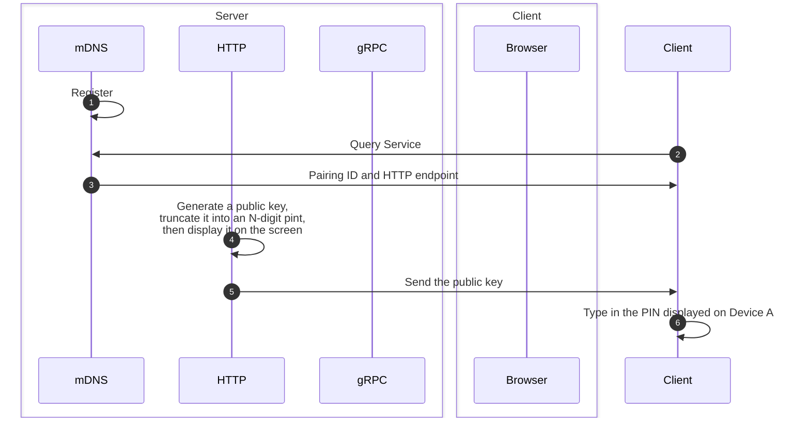

Month ago, I was working in a side project that provided a secure way for medical devices within a local subnet to pair with each other, and allow one of the devices build a long-lived connection to constantly fetch sensitive data. My first thought was, this should work as easy-to-understand as car play, no matter what. My colleague and I brainstormed this based on what we had for those devices:

<!-- description -->

One issue we had was, the certificate was too big to be encrypted with RSA itself, so we decided to encrypt it using AES and then encrypt the AES key with RSA, which is much smaller with the server's certificate. The HTTP request from client to server then contained both the encrypted AES key and the encrypted certificate.

:::note
HTTP and gRPC servers must be running at `0.0.0.0` or `[::]` to be accessible from other devices.
:::
