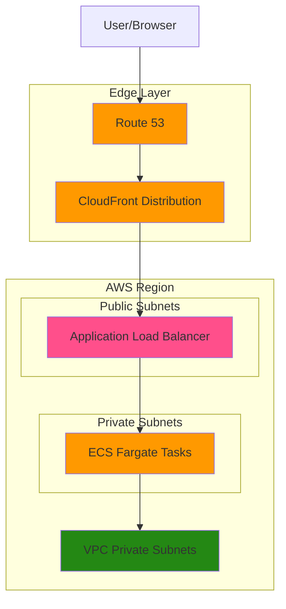

# Contributing Cloud



### Deployment

Retrieve AWS Access Key ID and Security Access Key from [IAM - Security Credentials - Create Access Key](https://us-east-1.console.aws.amazon.com/iam/home?region=us-east-1#/security_credentials/access-key-wizard) and configure AWS CLI by running the following to store credentials in `~/.aws/credentials`. This will allow Terraform to use the credentials automatically for `aws` provider:

```shell
aws configure
```

You can verify the `AccessKeyId`, `SecretAccessKey` from your local default AWS CLI profile by running:

```shell
aws configure export-credentials \
    --profile default
```

> [!note]
> Run `aws sts get-caller-identity` to verify that the account and user identities.

#### Workflow

Roughly the deployment workflow is as follows:

```shell
export ENVIRONMENT="development"

terraform init -backend-config="${ENVIRONMENT}.tfbackend"
terraform fmt
tflint
terraform validate
terraform plan -var "environment=${ENVIRONMENT}"
terraform apply -var "environment=${ENVIRONMENT}"
```
