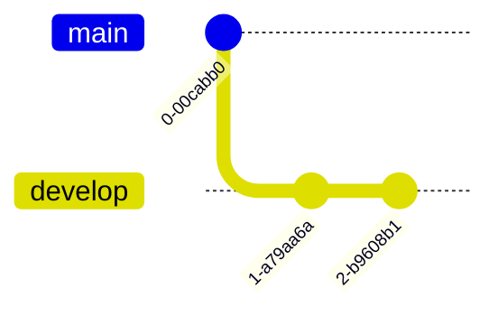
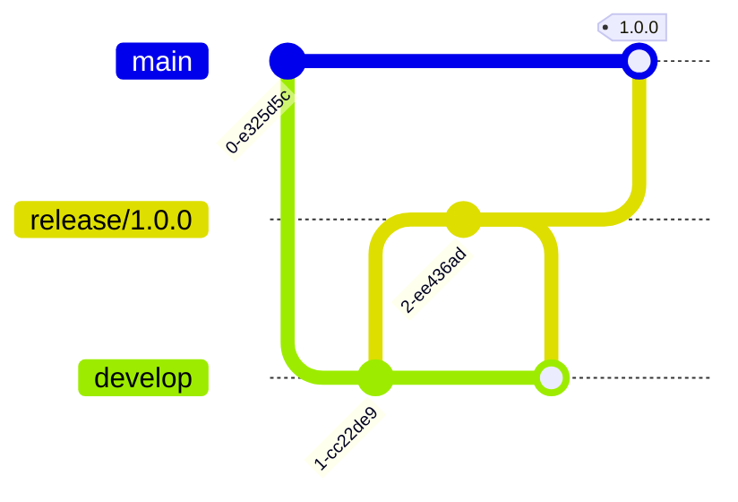
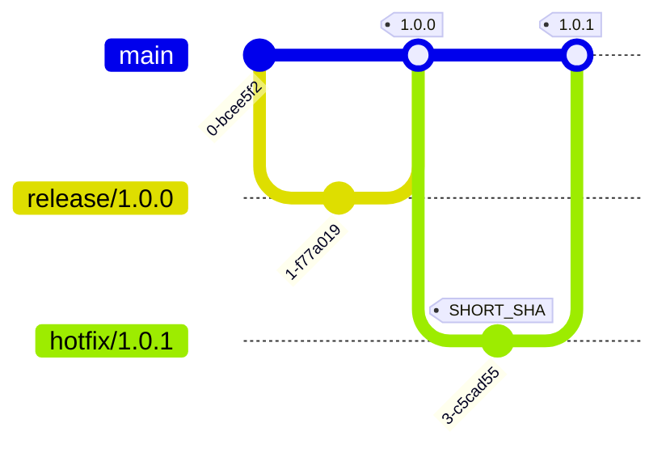
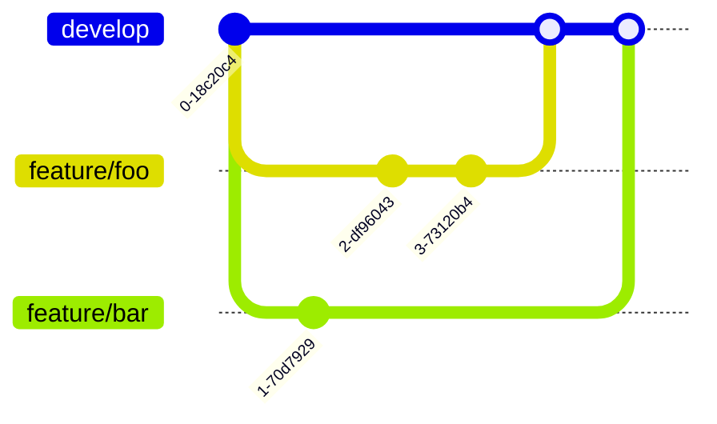
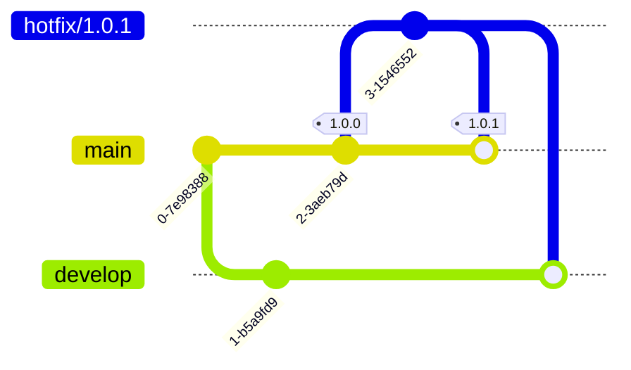

[Git Flow](https://nvie.com/posts/a-successful-git-branching-model/) is a branching model for Git, originally created by Vincent Driessen. I have been using this development flow since day 1 working at [Shopee](https://shopee.tw/). This was really helpful for multiple developers working on a product that don't need to support different versions in parallel, but have to deploy to different environments in a sequential flow, such as development, testing, staging, and production. When I was working at [CooperSurgical](https://www.coopersurgical.com/), there were some products require the similar flow, so I designed a more general workflow for managing projects with GitLab.

<!-- description -->

:::note
In this article, `<SHORT_SHA>` refers to the first 8 digits of a Git commit identifier, such as `bfaff80d`. `#.#` and `#.#.#` refer to semantic versioning where `#` can be any positive integer, such as `1.5` and `9.18`.
:::

## Overview

Here's a table that indicates the branch naming convention and what branches could be created from each branch:

| Branch           | Git Tag                                                          | Docker Image    | NuGet Package                                                          | Created From | Merge To             |
| ---------------- | ---------------------------------------------------------------- | --------------- | ---------------------------------------------------------------------- | ------------ | -------------------- |
| `main`           | `main-<SHORT_SHA>` for debugging and `#.#.#` for making releases | Same as Git Tag | `0.0.0-main.<SHORT_SHA>` for debugging and `#.#.#` for making releases |              |                      |
| `develop`        | `develop-<SHORT_SHA>` for debugging                              | Same as Git Tag | `0.0.0-develop.<SHORT_SHA>` for debugging                              | `main`       |                      |
| `feature/<name>` | `feature-<name>-<SHORT_SHA>` for debugging                       | Same as Git Tag | `0.0.0-feature.<name>.<SHORT_SHA>` for debugging                       | `develop`    | `develop`            |
| `release/#.#.#`  | `release-#.#.#-<SHORT_SHA>` for debugging                        | Same as Git Tag | `0.0.0-release.#.#.#.<SHORT_SHA>` for debugging                        | `develop`    | `main` and `develop` |
| `hotfix/#.#.#`   | `hotfix-#.#.#-<SHORT_SHA>` for debugging                         | Same as Git Tag | `0.0.0-hotfix.#.#.#.<SHORT_SHA>` for debugging                         | `main`       | `main` and `develop` |

:::note
Use the following regex for branch name matching on _GitLab - Project - Settings - Repository - Push Rules_:

```
^(main|develop|feature\/[a-zA-Z0-9._-]+|(release|hotfix)\/\d+\.\d+\.\d+)$
```


:::

### Mapping

Use the scripts in this sections to map the tag to the targeted environment.

#### NuGet

Only semantical versioning values are allowed:

```shell
#!/bin/bash

# main-<SHORT_SHA> to 0.0.0-main.<SHORT_SHA>
if [[ "$CI_COMMIT_TAG" =~ ^main-([a-f0-9]+)$ ]]; then
    _VERSION="0.0.0-main.${BASH_REMATCH[1]}"
# develop-<SHORT_SHA> to 0.0.0-develop.<SHORT_SHA>
elif [[ "$CI_COMMIT_TAG" =~ ^develop-([a-f0-9]+)$ ]]; then
    _VERSION="0.0.0-develop.${BASH_REMATCH[1]}"
# feature-<name>-<SHORT_SHA> to 0.0.0-feature.<name>.<SHORT_SHA>
elif [[ "$CI_COMMIT_TAG" =~ ^feature-([z-a0-9-]+)-([a-f0-9]+)$ ]]; then
    _VERSION="0.0.0-feature.${BASH_REMATCH[1]}.${BASH_REMATCH[2]}"
# release-#.#.#-<SHORT_SHA> to 0.0.0-release.#.#.#-<SHORT_SHA>
elif [[ "$CI_COMMIT_TAG" =~ ^release-([0-9]+\.[0-9]+\.[0-9]+)-([a-f0-9]+)$ ]]; then
    _VERSION="0.0.0-release.${BASH_REMATCH[1]}.${BASH_REMATCH[2]}"
# hotfix-#.#.#-<SHORT_SHA> to 0.0.0-hotfix.#.#.#-<SHORT_SHA>
elif [[ "$CI_COMMIT_TAG" =~ ^hotfix-([0-9]+\.[0-9]+\.[0-9]+)-([a-f0-9]+)$ ]]; then
  _VERSION="0.0.0-hotfix.${BASH_REMATCH[1]}.${BASH_REMATCH[2]}"
else
    echo "Invalid CI_COMMIT_TAG format: $CI_COMMIT_TAG"
    exit 1
fi

echo "$_VERSION"
```

## Main and Develop Branches

Main branch contains production-ready code, and every commit should be a release-ready state. Develop branch contains the latest changes for the next release:



## Release Branches

Release branches support the preparation of a new production release. They allow for last-minute defect fixes and preparing release metadata. They are created from the `develop` branch, followed by merging onto the `main` branch, and merged back into both `develop` and `main` branches upon completion:



## Tags

Tags are used to create releases. They are created on the `release` branches following semantic versioning for marking release points or on any branch using `SHORT_SHA` for marking debugging points:



## Feature Branches

Feature branches are used to develop new features or improvements. They are created from the `develop` branch and merged back upon completion:



## Hotfix Branches

Hotfix branches are used to address critical issues or security breaches. They are created from the `main` branch and merged back into both `main` and `develop` branches upon completion:


