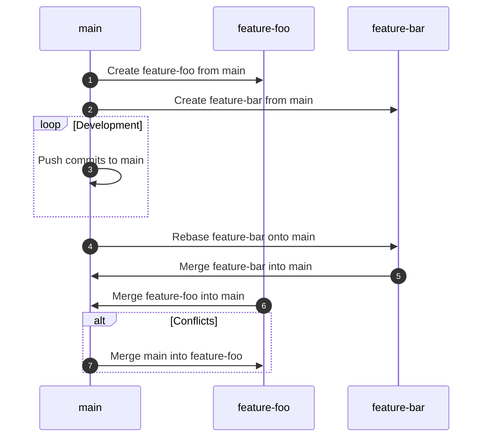

A collection of tips that I learned this month. Mostly from work. Just putting them here for future reference.


<!-- description -->

#### Use Environment Variable in Document Generation

This can apply to any document generation tool that doesn't support environment variables natively. We first implement our own helper function:

```shell
helper_substitute() {
    local _FILE_INPUT="$1"
    local _FILE_OUTPUT="$2"

    local _FILE_SUBSTITUTED="$_FILE_OUTPUT.substituted"

    envsubst < "$_FILE_INPUT" | sudo tee "$_FILE_SUBSTITUTED" > /dev/null
    sed 's/__DOLLAR__/$/g' "$_FILE_SUBSTITUTED" | sudo tee "$_FILE_OUTPUT" > /dev/null
    sudo rm "$_FILE_SUBSTITUTED"

    return 0
}
```

Note that I have 2 layers of substitution here. The first layer is to substitute environment variables using `envsubst`. The second layer is to replace `__DOLLAR__` back to `$` because `envsubst` would also substitute `$` in template syntax, such as Go templates. So we temporarily replace `$` with `__DOLLAR__` before calling `envsubst`, then revert it back afterward.

##### Usage Example

Then we can use this helper function to substitute environment variables. For example, in a Protobuf document generation scenario:

```html title="./html.tmpl"
<body>
  <h2>Version: ${DOCUMENT_VERSION}</h2>

  <ul id="toc">
    {{range .Files}} {{__DOLLAR__file_name := .Name}}
    <li>
      <a href="#{{.Name}}">{{.Name}}</a>
      <ul>
        {{range .Messages}}
        <li>
          <a href="#{{.FullName}}"><span class="badge">M</span>{{.LongName}}</a>
        </li>
      </ul>
    </li>
    {{end}}
  </ul>
</body>
```

```shell
helper_substitute "./html.tmpl" "./templates/html.tmpl"
```

You can then generate the document with the `pseudomuto/protoc-gen-doc` Docker image:

```shell
docker run --rm \
  --volume "$PWD/templates/:/templates/" \
  --volume "$PWD/schemas/:/protos/" \
  --volume "$PWD/generated/:/out/" \
  --name "protoc-gen-doc" pseudomuto/protoc-gen-doc:latest \
  --doc_opt=/templates/html.tmpl,/out/index.html
```

Same technique can be applied to other configuration files, such as RabbitMQ configuration:

```json title="./definition.json"
{
  "users": [{ ..., "password_hash": "${RABBITMQ_PASSWORD_HASHED}" }]
}
```

```conf title="./rabbitmq.conf"
definitions.local.path = ${DEFINITIONS_SUBSTITUTED}
collect_statistics = ${COLLECT_STATISTICS}
```

```shell
export RABBITMQ_PASSWORD_HASHED=$(sudo rabbitmqctl hash_password "${_PASSWORD}" | sed -n '2p')
export DEFINITIONS_SUBSTITUTED="/etc/rabbitmq/definitions.json"

if [ "$LIBDEV_ENVIRONMENT" = "development" ]; then
    export COLLECT_STATISTICS="coarse"
else
    export COLLECT_STATISTICS="none"
fi

helper_substitute "./definitions.json" "$DEFINITIONS_SUBSTITUTED"
helper_substitute "./rabbitmq.conf" "/etc/rabbitmq/rabbitmq.conf"
```

#### Git Rebase Conflicts with Multiple Features

Suppose we have two feature branches, `feature-foo` and `feature-bar`, both created from `main`. If we rebase `feature-bar` onto `main` and then merge `feature-bar` into `main`, `feature-foo` may encounter conflicts when we try to rebase it onto the updated `main`. To avoid this, merge `main` into `feature-foo` first to resolve conflicts, then rebase or merge as needed:



#### GitLab Environment

I misused the `environment` keyword in my CI/CD pipelines for a while, thinking it would be something related to setting up a whole environment. But it turns out to be just a link to the deployed site anywhere on the UI. I guess this is when I stated acknowledging GitLab is more web-deployment-oriented.

:::note
See [GitLab Docs Environment](https://docs.gitlab.com/ci/environments/) for more details.
:::

#### GitLab Pages Multiple Sites

Publish GitLab Pages to different sites using the same path. This will allow multiple sites live in the same instance like `/1.0`, `/2.0`, etc. However, the root path `/` can not be used or it must be a no-route page:

```yaml
pages:
  rules:
    - if: "$CI_COMMIT_TAG"
  stage: "deploy"
  script: |
    mkdir --parent "./public/$CI_COMMIT_TAG/"
    chmod --recursive 777 "./public/"

    cp --recursive "/tmp/document/." "./public/$CI_COMMIT_TAG/"
  dependencies:
    - "document"
  artifacts:
    paths:
      - "./public/"
```

:::note
This trick requires lots of hassle, such as linking to the correct path, educating not to use the root path, etc. Only a few months after I learned this trick, GitLab introduced the `pages` keyword and I have implemented it in [Multiple GitLab Pages](/blog/2025-10-01). The new way is much cleaner and allow publishing to multiple sites easily, including the root path.
:::

#### GitLab Configuration as Code

I haven't gotten a chance to try it out, but it looks very promising when I need to manage GitLab instances programmatically. It reminds me how [Terraform](https://www.terraform.io/) instruct UI actions into code, but specifically for GitLab.

:::note
See [GitLab Configuration as Code](https://github.com/Roche/gitlab-configuration-as-code) repository for more details.
:::

#### Weston Terminal

`weston.ini` is the configuration file for the Weston terminal:

```conf title="weston.ini"
[terminal]
font-size=<font-size-value>
```

:::note
See [Ubuntu Weston](https://manpages.ubuntu.com/manpages/questing/en/man5/weston.ini.5.html) for more details.
:::

#### Silence Output in Linux

To silence both standard output and error output:

```shell
command > /dev/null 2>&1
```

To silence only error output:

```shell
command 2> /dev/null
```

To silence only standard output:

```shell
command > /dev/null
# or
command 1> /dev/null
```

#### CROSS JOIN and FULL OUTER JOIN in SQL

A `CROSS JOIN` produces a cartesian product between the two tables, returning all possible combinations of all rows. It has no `ON` clause because you're just joining everything to everything.

A `FULL OUTER JOIN` is a combination of a `LEFT OUTER JOIN` and `RIGHT OUTER JOIN`. It returns all rows in both tables that match the query's `WHERE` clause, and in cases where the `ON` condition can't be satisfied for those rows it puts `NULL` values in for the unpopulated fields.

:::note
[Wikipedia Join (SQL)](<https://en.wikipedia.org/wiki/Join_(SQL)>) explains the various types of joins with examples very well.
:::

#### JOIN ON and USING

They do pretty much the same thing, but `ON` allows more complex conditions, while `USING` is more concise when the columns have the same name, hence doesn't require table name prefixes.

:::note
[Stack Overflow MySQL JOIN ON vs USING?](https://stackoverflow.com/questions/11366006/mysql-join-on-vs-using) has good responses explaining the difference.
:::

#### CSS Selector for Adjacent Siblings and General Siblings

`+` and `~` allow use to select sibling elements in CSS. I was wondering why we couldn't select elements _before_ the element at the first glance, but it makes sense at the second glance because browsers parse and render HTML in document order. Backward selection would require looking ahead or re-parsing:

```css
/* adjacent sibling: only the first <p> after <h2> */
h2 + p {
  margin-top: 0;
}

/* general sibling: all <p> after <h2> */
h2 ~ p {
  color: #555;
}
```

:::note
See [MDN CSS Selectors Reference](https://developer.mozilla.org/en-US/docs/Web/CSS/Guides/Selectors#reference) for more details.
:::

#### The Twelve-Factor App

[THE TWELVE-FACTOR APP](https://12factor.net/) is a methodology for building software-as-a-service apps. I only learned about it recently, but it surprisingly aligns to what I have been practicing in my projects. I guess this is the principle underneath many tech articles shared by experienced developers.

#### AOT and JIT in JavaScript

I am confused about this because some developers claim that there is no compiler in JavaScript/TypeScript. According to Wikipedia, [Ahead-of-Time](https://en.wikipedia.org/wiki/Ahead-of-time_compilation), AOT, _is the act of compiling an (often) higher-level programming language into an (often) lower-level language before execution of a program, usually at build-time, to reduce the amount of work needed to be performed at run time_. On the other hand, [Just-in-Time](https://en.wikipedia.org/wiki/Just-in-time_compilation), JIT, _is compilation during execution of a program (at run time) rather than before execution_. I believe both AOT and JIT exist in the JavaScript ecosystem in different forms:

- Transpilers and bundlers such as Babel, TypeScript Compiler, and Webpack transform code before execution
- JavaScript engines like V8 and SpiderMonkey use JIT compilers to optimize code during execution
- Frameworks, such as Angular, and technologies like WebAssembly can use AOT compilers to pre-compile code before deployment

#### System Design and Product Design

System design focuses on the technical architecture, components, and interactions within a system to meet specific requirements. Product design encompasses the overall user experience, features, and market fit of a product, considering both technical and business aspects.

#### Backtracking Algorithm

:::note
[拉爾夫的技術隨筆 演算法學習筆記：回溯法（Backtracking）& 分支定界法（Branch and Bound）](https://medium.com/@ralph-tech/%E6%BC%94%E7%AE%97%E6%B3%95%E5%AD%B8%E7%BF%92%E7%AD%86%E8%A8%98-%E5%9B%9E%E6%BA%AF%E6%B3%95-backtracking-%E5%88%86%E6%94%AF%E5%AE%9A%E7%95%8C%E6%B3%95-branch-and-bound-29165391c377) has a deep explanation.
:::
