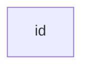

Some stuff I learned this month.



<!-- description -->

#### GitLab Environment

As what GitLab is specialized for web deployment, the environment in GitLab CI/CD is only a quick URL to. However, it provides convenience to direct users to the deployed URL everywhere in GitLab.

:::note
See [GitLab Environment](https://docs.gitlab.com/ci/environments/) for more details.
:::

#### Weston Terminal

`weston.ini` is the configuration file for the Weston terminal:

```conf title="weston.ini"
[terminal]
font-size=<font-size-value>
```

:::note
See [Ubuntu Weston](https://manpages.ubuntu.com/manpages/questing/en/man5/weston.ini.5.html) for more details.
:::

#### Silence Output in Linux

To silence both standard output and error output:

```bash
command > /dev/null 2>&1
```

To silence only error output:

```bash
command 2> /dev/null
```

To silence only standard output:

```bash
command > /dev/null
# or
command 1> /dev/null
```
