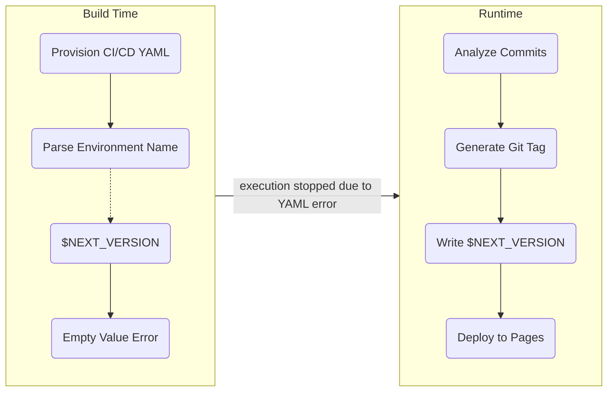

I encountered a challenge while deploying multiple GitLab Pages using Git tags generated by Semantic Release. These tags, such as `1.1.2`, are created dynamically at runtime after commit analysis, making them unavailable during the initial pipeline configuration. As a result, the GitLab CI/CD pipeline failed to execute due to the absence of the `$NEXT_VERSION` variable:



After some trial and error, I discovered Dynamic Pipelines as a solution. However, implementing them required overcoming several undocumented issues.

<!-- description -->

Dynamic pipelines are a solution to create jobs with variables that are only known at runtime because GitLab CI/CD parses and substitutes most `.gitlab-ci.yml` variables before executing the jobs. I was facing this issue when I was try to deploy multiple GitLab Pages using the Git Tag created by Semantic Release, which is only available after the commits are analyzed.

Dynamic Pipelines enable the creation of jobs with variables that are only determined at runtime, addressing the limitation where GitLab CI/CD substitutes most .gitlab-ci.yml variables before job execution. This article will guide you through setting up Dynamic Pipelines, configuring Semantic Release, and deploying multiple GitLab Pages effectively.

I was solving an issue [Using User Defined Environment Variables with Dynamic Environments](https://forum.gitlab.com/t/using-user-defined-environment-variables-with-dynamic-environments-or-multi-project-pipelines/54258/4), then found a workaround by using dynamic child pipelines. However, the artifacts from the parent pipeline are not passed to the child pipeline:

:::note
See [GitLab Dynamic Child Pipelines](https://docs.gitlab.com/ci/pipelines/downstream_pipelines/#dynamic-child-pipelines) for more details.
:::

```yml title="./.gitlab-ci.yml"
create-pipeline:
  rules:
    - exists:
        - "./.next-release-version"
  stage: "prepare"
  tags:
    - $RUNNER
  script: |
    NEXT_RELEASE_VERSION=$(cat ./.next-release-version) npm run "ci:${CI_JOB_NAME}"
  artifacts:
    paths:
      - "./.gitlab-ci.dynamic.yml"
    expose_as: "Dynamic Pipeline Configuration"
    expire_in: "1 day"
  dependencies:
    - "publish-registry-release"

trigger-pipeline:
  rules:
    - exists:
        - "./.gitlab-ci.dynamic.yml"
  stage: "trigger"
  trigger:
    include:
      - artifact: "./.gitlab-ci.dynamic.yml"
        job: "create-pipeline"
    strategy: "mirror"
  needs:
    - job: "create-pipeline"
      artifacts: true
```


The solution is pretty simple, although it took me a while to figure it out.

Some other findings are:

- In the dynamically created pipeline, `.gitlab-ci.dynamic.yml` in this case, using alias (`*`) to reference anchors in the parent pipeline `gitlab-ci.yml` is not supported. So you have to repeat the configuration if needed
- If a job is depended by another job using `needs`, it must exist. Otherwise, the job that depends on the other fails automatically. In this example, `create-pipeline` only exists when `./.next-release-version` exists. So I have to add `rules:exists: ./.gitlab-ci.dynamic.yml` to prevent the job from failing. The other option is to add `needs:optional: true`

## Undocumented Issues

[Using User Defined Environment Variables with Dynamic Environments](https://forum.gitlab.com/t/using-user-defined-environment-variables-with-dynamic-environments-or-multi-project-pipelines/54258/4)

[GitLab Dynamic Child Pipelines](https://docs.gitlab.com/ci/pipelines/downstream_pipelines/#dynamic-child-pipelines) and [GitLab CI/CD YAML Syntax Reference](https://docs.gitlab.com/ci/yaml/#triggerinclude)

https://forum.gitlab.com/t/using-user-defined-environment-variables-with-dynamic-environments-or-multi-project-pipelines/54258/4

https://medium.com/@datails/stop-running-static-scoped-jobs-in-gitlab-run-dynamically-created-jobs-instead-481bb686cea5

### Dependencies

Use needs:optional when must execute, use rules when no-parent-no-execution

### Isolated Pipelines

child pipeline doesn't share anything from main: dependencies, stage, variable, default, etc

### Artifact Size Limit

5mb

### CI Token Limit

CI_JOB_TOKEN doesn't work. I had to use Project Access Token
